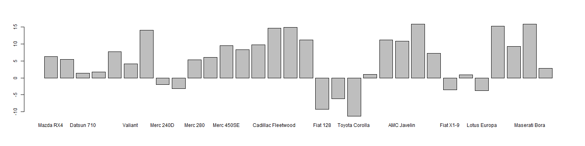

Trip-specific Vehicle Reccomendations from Data
========================================================
author: Samadin
date: 21 Septemebr 2014

Who's driving?
========================================================

You've decided to go on a road trip. You've picked out your destination. All that's left is to pick a car! But which one will you decide?

- Some cars are faster than other, reducing the total transit time
- time = money
- However, cars have varying fuel economy
- gas costs money

**If only there was a tool to help you determine the most economical choice...**

Our app takes care of transit time
========================================================

##### Just enter your state of origin and destination.

- The app uses the latitude and longitude of the center of each state
- A drop down window allows you to choose from one of over 30 prospective rides
- Using motor trend data, we estimate the transit time based specifically on the vehicles specifications (e.g. quarter mile time)
- Version 0.2 will integrate fuel economy meansured in miles per gallon!

Optimization Algorithm (v0.1)
========================================================

Using vehicle specs, we can come up with an efficieny of transit index. Analyzing our data with both gas prices and the value of your time in mind, we can compare this index among the 32 cars in our data set.

 
The top performer is the Camaro Z28

Check it out!
========================================================

Customize your experience by adding your destination
